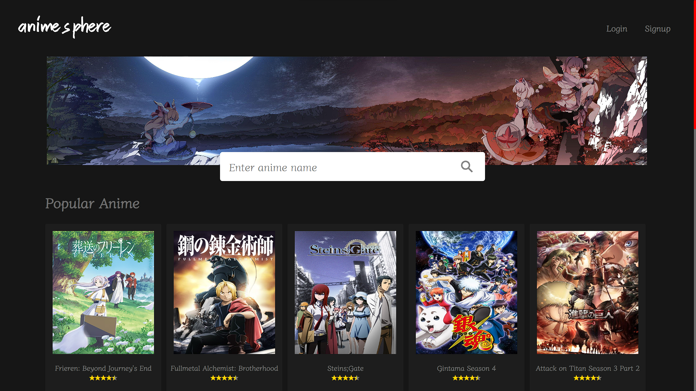

# Anime Sphere

Anime Sphere is a full-stack web application built with React that serves as a centralized hub for discovering, browsing, and managing your favorite animes. Users can explore a vast collection of anime titles and easily mark their favorites for quick access.

## ✨ Features

- Browse and discover anime from a comprehensive collection
- Mark favorite animes with one-click functionality
- Responsive design optimized for all devices
- Persistent state management with Redux
- Secure authentication and data handling

## 🛠 Tech Stack

### Frontend
```
React          - User interface framework
Axios          - HTTP client for API calls
Firebase       - Provides Authentication
React Redux    - State management
React Hot Toast- Notification system
```

### Backend
```
Node.js    - Runtime environment
Express.js - Web framework
MongoDB    - NoSQL database
```

## 🚀 Quick Start

### 1. Clone the repository
```bash
git clone https://github.com/intensityGod007/anime-sphere.git
cd anime-sphere
```

### 2. Backend Setup
```bash
cd backend
npm install
# Add backend environment variables to .env
npm run dev
```

### 3. Frontend Setup
```bash
cd ../frontend
npm install
# Configure Firebase config in src/config/firebase.js and edit .env
npm start
```

### 4. Access the app
- Frontend: http://localhost:3000
- Backend API: http://localhost:4000

## 🔧 Environment Variables

### Backend (.env)
```env
NODE_ENV="development"
MONGODB_URI=your_mongodb_connection_string
```

### Frontend (Firebase config + .env)
Configure in `src/config/firebase.js` with your Firebase project credentials.
```env
REACT_APP_API_KEY = your-react-app-api-key
REACT_APP_AUTH_DOMAIN = your-react-app-auth-domain
REACT_APP_PROJECT_ID = your-react-app-project-id
REACT_APP_STORAGE_BUCKET = your-react-app-storage-bucket
REACT_APP_MESSAGING_SENDER_ID = your-react-app-messaging-sender-id
REACT_APP_APP_ID = your-react-app-id
REACT_APP_MEASUREMENT_ID = your-react-app-measurement-id

REACT_APP_BACKEND_API = "http://localhost:4000/api/animeRoutes"
```

## 📖 API Endpoints

| Method | Endpoint                             | Description                             |
|--------|--------------------------------------|-----------------------------------------|
| GET    | `/api/animeRoutes/getAnime`          | Get a list of user's added animes       |
| POST   | `/api/animeRoutes/anime/:mal_id`     | Add anime                               |
| DELETE | `/api/animeRoutes/myAnime/:id`       | Delete an anime from my-anime list      |
| GET    | `/api/animeRoutes/findAnime`         | Find an anime from the database         |

## 🖼️ Screenshots

